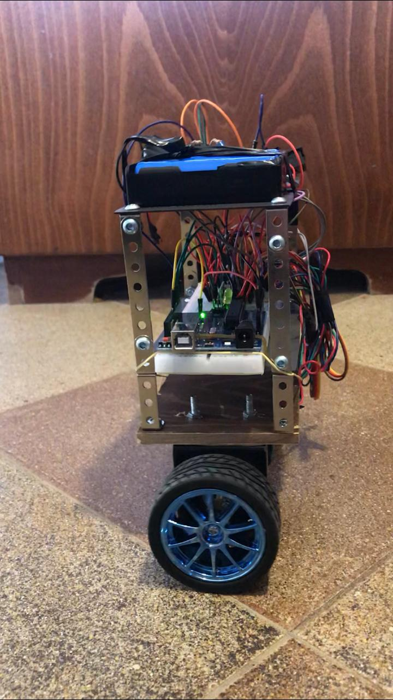

# Self Balancing Robot

## Introduction

Two wheel Self Balancing Robot built using Arduino and controlled via an Android mobile application and an ESP server.

To watch videos of the robot in action:

- Click [here](https://youtu.be/xCSxdwbZF8M) for video 1
- Click [here](https://youtu.be/HZiSrUaagcw) for video 2

To check the code for the Arduino, click [here](balancingRobot/Balancing_robot/Balancing_robot.ino).

To check the code for the ESP server, click [here](balancingRobot/ESP_server/ESP_server.ino).

To check the code for the Android Mobile Application Remote Control, click [here](balancingRobot/RemoteControl).

## Hardware Used
- Arduino
- MPU-6050 gyro and accelerometer
- Stepper motors
- Geeetech StepStick DRV8825
- ESP8266
- Mini DC 7~28V to DC 5V step-down converter
- Battery
- Resistors
- Diodes

## Main Components

### **Remote Controller**

The remote controller is an android application built using Android studio.
There is a server on the ESP8266, and the android application connects to that server via Sockets.The connection is made using a local network.

### **ESP Server**

The ESP8266 receives a string from the android application (via the sockets). It receives "0", "1", "2", "3" or "4" :

- "0": stop

- "1": go backwards

- "2": go forward

- "3": turn left

- "4": turn right

Then the ESP sends byte data to the arduino via TX, and the arduino reads those data via RX.

### **Robot**

The robot uses stepper motors instead of regular DC motors. The main reason is that stepper motors are precise and have no performance loss when the battery voltage drops. One pulse is always an exact amount of motion. Regular DC motors can have mechanical friction and electric resistance differences. This can cause performance differences. As a result the robot will not move in a straight line.

We are using the MPU-6050 GYRO to calculate the angular tilt of the robot.

We are using a 12v battery for the stepper controllers (Motor side), and a 9v battery for the rest of the components.

There is a 9V to 5V voltage transformer connected to the 9V battery as INPUT, and its OUTPUT is connected to the arduino, the gyro, the ESP and the stepper controllers (Logic side).

The GYRO is connected to the arduino by I2C bus.

the ESP is connected to the arduino by Serial (TX, RX).

the stepper controllers are DRV8825, and they are calibrated so that the maximum current becomes 1.4 Ampers.

## Pictures

### Robot Front View

### Robot Side View

